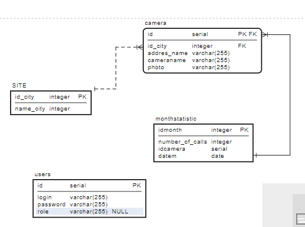

# Backend


Основной стек технологий:
Rest API на языке Python, фреймворк FastAPI
БД - PostgreSQL

Демо:
https://backheironka.herokuapp.com/docs
Реквизиты тестового пользователя: login: admin, пароль: admin123

1. Установка зависимостей
```bash
foo@bar:~$ pip install requirements.txt
```
2. Запуск
```bash
foo@bar:~$ python main.py
```



РАЗРАБОТЧИКИ
Алина Лебедева DATA-scientist, Backend  Telegramm:@leba129
